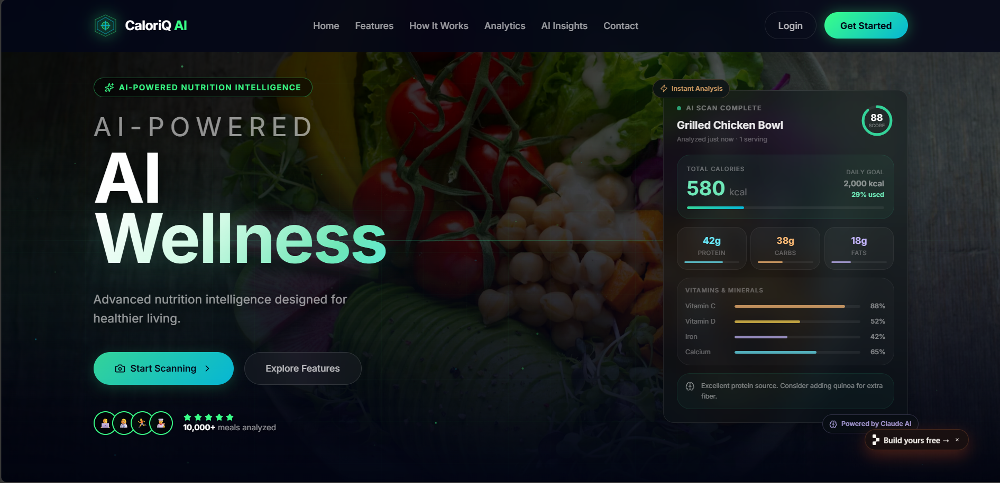
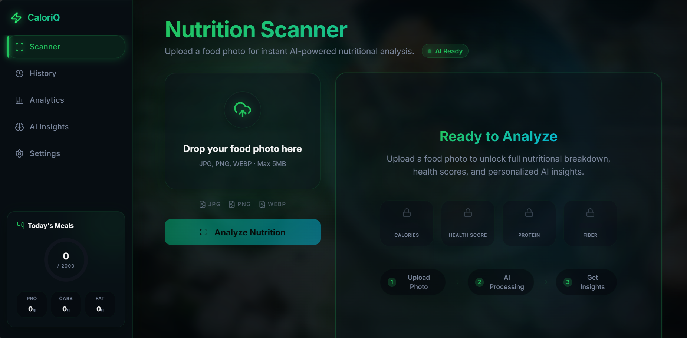
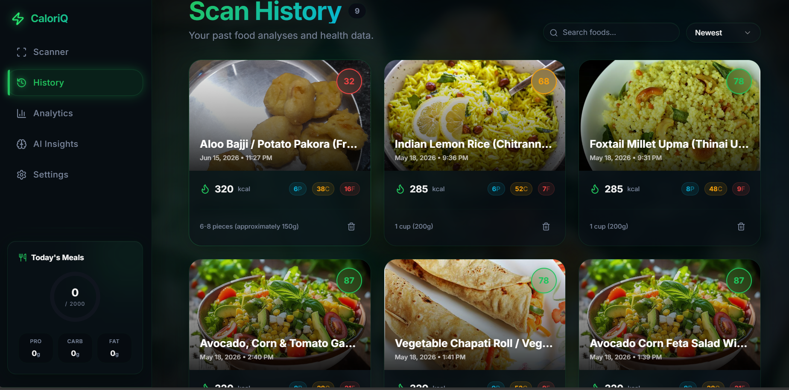
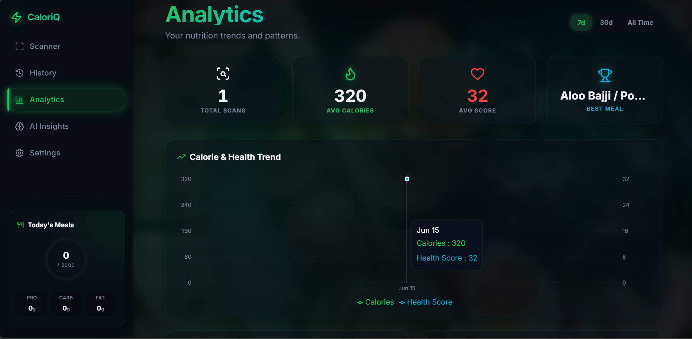
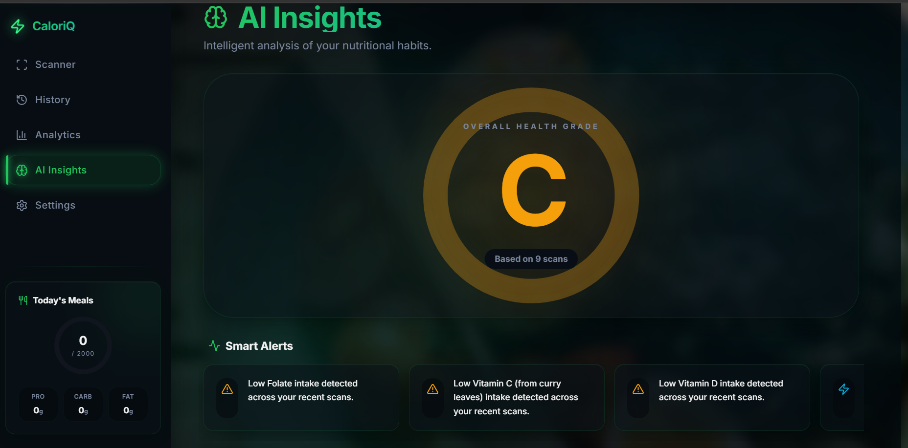
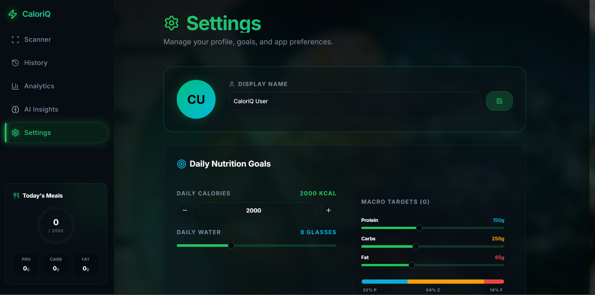

# 🥗 CaloriQ AI


## AI-Powered Nutrition Intelligence Platform

Analyze food images, track nutrition, monitor health trends, and receive personalized AI-powered dietary insights.



## 🚀 Highlights

✅ Food Image Recognition
✅ Calorie Estimation
✅ Health Score Generation
✅ AI-Powered Insights
✅ Meal History Tracking
✅ Analytics Dashboard
✅ Goal Management
✅ Responsive Modern UI

## 💡 Motivation

Many people struggle to understand the nutritional value of their meals.

CaloriQ AI was built to simplify nutrition tracking using artificial intelligence by transforming a simple food image into actionable health insights.

## 🛠️ Tech Stack

### Frontend

* React.js
* JavaScript
* HTML5
* CSS3
* Tailwind CSS

### Backend

* Node.js
* Express.js
* REST API Development

### Database

* PostgreSQL
* Supabase

### AI Integration

* Google Gemini Vision API
* Computer Vision
* AI-powered nutrition analysis

### Tools

* Git
* GitHub
* VS Code
* Replit

## 🧠 System Architecture

```text
Food Image
     │
     ▼
React Frontend
     │
     ▼
REST API
     │
     ▼
Node.js + Express Backend
     │
     ▼
Gemini Vision API
     │
     ▼
Nutrition Analysis
     │
     ▼
PostgreSQL / Supabase Database
     │
     ▼
Analytics & Insights
```

## 🔍 AI Nutrition Scanner

Upload food images and receive instant nutritional analysis powered by Google Gemini Vision API.



## 📜 Scan History

View previously scanned meals with calories, macronutrients, health score, and meal details.



## 📊 Analytics Dashboard

Track calorie intake, nutrition trends, average health score, and meal performance.



## 🧠 AI Insights

Get smart health alerts, nutrition recommendations, and personalized dietary suggestions.



## ⚙️ Settings & Goal Management

Manage profile details, daily calorie goals, water intake, and macronutrient targets.



## ⚡ Challenges Solved

* Food image interpretation using AI
* Nutrition extraction from unstructured AI responses
* Health score calculation
* Analytics dashboard visualization
* State management across multiple modules
* Reusable component-based frontend design

## 🔮 Future Enhancements

* Authentication & User Profiles
* AI Meal Planning
* Barcode Scanner
* Weekly Health Reports
* PDF Nutrition Report Generation
* Mobile Application
* Wearable Device Integration

## 📌 Resume Summary

Built a full-stack AI-powered nutrition intelligence platform using React.js, Node.js, PostgreSQL, Supabase, and Google Gemini Vision API to analyze food images, estimate calories, track meal history, and provide health analytics through an interactive dashboard.

## 👩‍💻 Author

**Matam Litika**

GitHub: https://github.com/matamlitika07-oss
LinkedIn: https://www.linkedin.com/in/matam-litika
